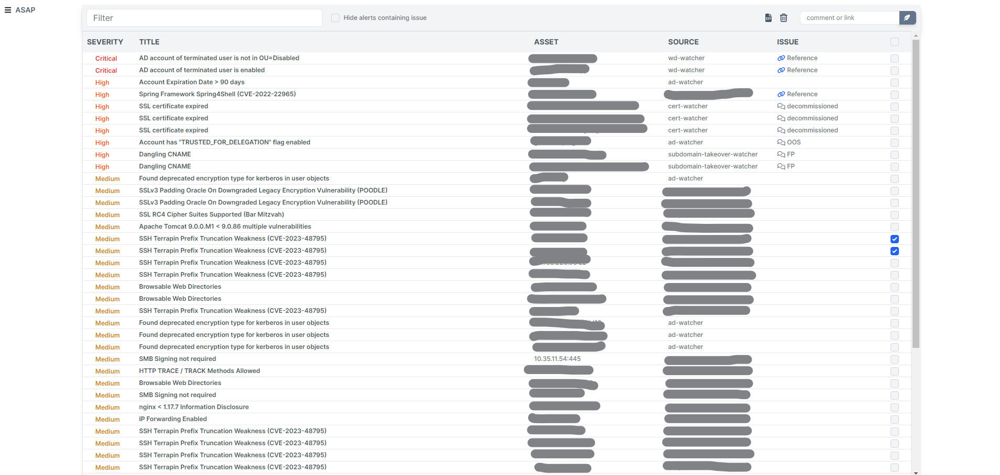

The application is a centralized registry of various security alerts. The alert may represent anything you can treat as potential security or privacy issue. You may think of the app as a dashboard of alerts, where you have convinient way to respond to every single alert or bunch of alerts.



## Development

To run the app in development environment:
```bash
bundle install
bin/dev
```

Note: it's expected that your postgres "trust" localhost Unix domain socket connections. Otherwise, modify config/database.yml

## Installation

Clone repository and deploy with [Kamal](https://kamal-deploy.org/):

1. `bundle install`
3. `kamal init`
4. prepare configuration. See next section.
4. configure deploy.yml and run `kamal setup`. See deploy.example.yml

If initial deployment fails, simply run `kamal remove`, fix deploy.yml and run `kamal setup` again.

Run `kamal deploy` for further deployments and updates.

## Kubernetes 
When writing manifests for deploying to k8s, make sure you pass all the environment variables as it is in deploy.example.yml

## Configuration

Possible settings are defined via environment variables. Please see .env.example.

Do not forget running `kamal env push` in case of changes

## Authentication

#### LDAP
This method uses simple LDAP bind and requires integration with LDAP/AD domain. Set up following variables:

    AUTH_METHOD: ldap
    - LDAP_HOST
    - LDAP_BASE
    - LDAP_USERNAME
    - LDAP_PASSWORD
    - LDAP_USERS_FILTER
    - LDAP_USERS_SEARCHBASE

#### SSO
You can set up SSO with OpenID connect

    AUTH_METHOD: sso
    - OIDC_HOSTNAME
    - OIDC_ISSUER
    - OIDC_AUTHORIZATION_ENDPOINT
    - OIDC_TOKEN_ENDPOINT
    - OIDC_USERINFO_ENDPOINT
    - OIDC_IDENTIFIER
    - OIDC_SECRET
    - OIDC_REDIRECT_URI

#### noauth
This method can be used only in development mode

    AUTH_METHOD: noauth

## Authorization

db/seeds.rb creates default account for you but this only makes sense for noauth method. For better user management you may want to define LDAP_USERS_SEARCHBASE to have authorized users provisioned by cron task (see deploy.example.yml)

## How to create alert?

Send a single POST request. An alert should at least contain severity, title, asset and source. The app takes md5 hash of title + asset and uses it as ID, so it could be recognized and updated on next occurrence.

##### Example with curl:
```bash
curl -X POST -H "Content-Type: application/json" -H 'X-API-Key: FakeAPIkey'  \
-d '{"title": "SSL certificate is about to expire", "asset": "dev.example.com", "severity": "High", "source": "cert-watcher"}' \
https://asap.mydomain.com/api/v1/alerts
```
##### Example with httpie:
```bash
http POST 'http://asap.mydomain.com/api/v1/alerts'  X-API-Key:FakeAPIkey \
title:="Vulnerability detected" \
asset:="10.10.0.105:8880" \
severity:="Critical" \
source:="nessus-watcher"
```
##### Supported params:
| Field | Required | Type | Description |
|-----------------|-----------------|-----------------|-----------------|
| title    | yes | string  | alerts title    |
| asset    | yes | string  | e.g. ip-address, user, domain name    |
| severity | yes | string  | must be one of Critical, High, Medium, Low    |
| source   | yes | string  | name of your watcher    |
| output   | no  | text  | displayed as is for convinience ignoring HTML tags |
| remediation | no | text  | e.g. from Nessus report or a link to SOC runbook |
| issue | no | string | field for response, e.g. comment or link to ticket |
| cve_list | no | array of strings | for CVEs |

## How to close alert?
Alerts may be simply closed manually. Also, there is source field that identifies a script or so-colled watcher where the entry comes from. The watcher is a sort of automation around some processes, systems, application and so on that result to posting alerts to the application. If the alerts created by watcher supposed to be closed at some point, watcher should provide a list with IDs of currently active alerts. So, old alerts will be closed according to the list.

##### Example with curl:
```bash
curl -X POST -H "Content-Type: application/json" -H 'X-API-Key: FakeAPIkey'  \
-d '{"source": "cert-watcher", "current_alerts": ["b4d10b7a-9385-332b-a2eb-55c6bf5f82a3", "94e62d48-f57b-3c26-bb61-84d74ebe3793"]' \
https://asap.mydomain.com/api/v1/arrange_alerts
```

## How to respond to alert?
You may assign a ticket to an alert by setting a link to the issue field in UI. Otherise, it's just a string which may be used as a short note or comment. Also if you have a guides/runbooks for you alerts you may put a link to remediation field when posting an alert.